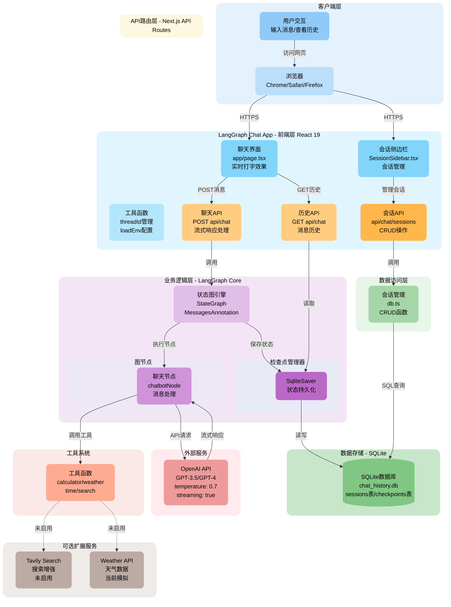
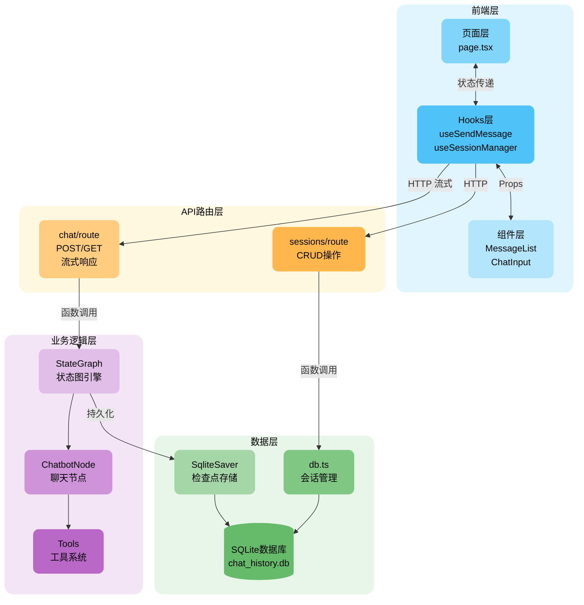
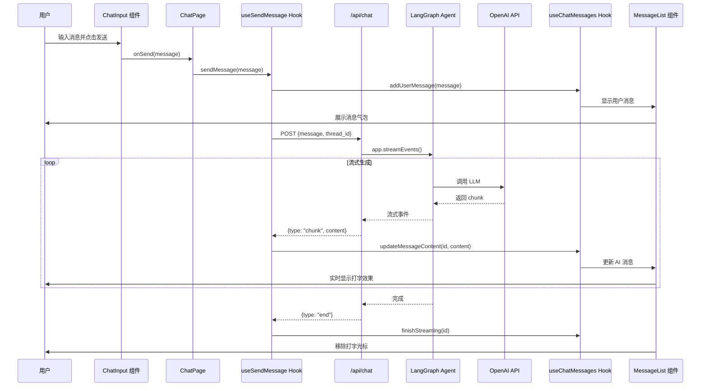
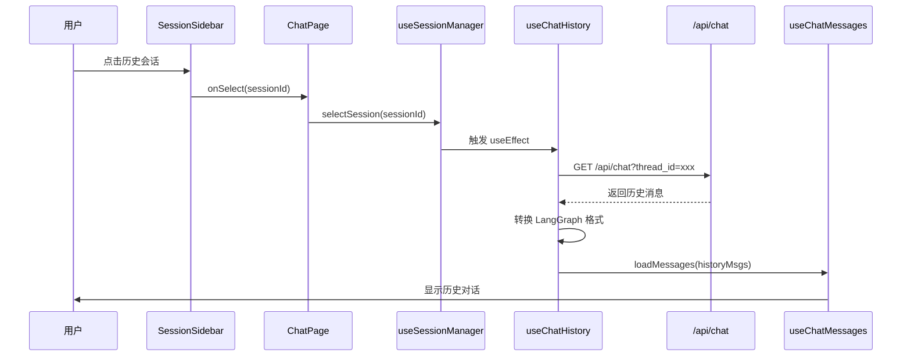

# LangGraph Chat App - 架构与技术文档

> 生成时间: 2025-11-23
> 项目名称: langgraphjs-chat-app
> 版本: 2.1.0

---

# 第一部分：架构文档

> 面向架构师、产品经理、研发管理层

---

## 1. 目标与问题域

### 1.1 项目定位

LangGraph Chat App 是一个基于 LangGraph 状态图引擎的全栈 AI 聊天应用，旨在提供：

- **实时对话体验**：流式响应，实时打字效果
- **多会话管理**：支持创建、切换、命名、删除多个对话会话
- **持久化存储**：对话历史和会话状态本地持久化
- **可扩展工具系统**：支持动态添加 Agent 工具能力

### 1.2 核心价值

| 价值维度 | 描述 |
|---------|------|
| **开发效率** | 基于 LangGraph 快速构建可控的 AI 对话流程 |
| **用户体验** | 流式响应 + Markdown 渲染，接近 ChatGPT 体验 |
| **可维护性** | 模块化架构，Hooks + 组件分离，职责清晰 |
| **可扩展性** | 工具系统支持热插拔，易于添加新能力 |

### 1.3 目标用户

- 需要快速搭建 AI 聊天应用的开发者
- 学习 LangGraph/LangChain 的技术研究者
- 需要定制化 AI 对话系统的企业团队

---

## 2. 架构视图

### 2.1 系统架构全景图



### 2.2 分层架构

| 层级 | 职责 | 关键技术 |
|------|------|----------|
| **客户端层** | 用户交互入口 | 浏览器 |
| **前端层** | UI渲染、状态管理、用户交互 | React 19, Next.js 16, Tailwind CSS |
| **API路由层** | 请求处理、流式响应、会话管理 | Next.js API Routes |
| **业务逻辑层** | AI对话引擎、状态图执行 | LangGraph, LangChain |
| **数据访问层** | 会话CRUD、检查点管理 | better-sqlite3 |
| **数据存储层** | 持久化存储 | SQLite |
| **外部服务层** | LLM推理 | OpenAI API |

### 2.3 模块边界



---

## 3. 关键设计决策

### 3.1 技术选型

| 决策 | 选择 | 理由 | 取舍 |
|------|------|------|------|
| **前端框架** | Next.js 16 + React 19 | 全栈一体化，API Routes 简化后端开发 | 学习曲线较高 |
| **AI框架** | LangGraph + LangChain | 状态图支持复杂对话流程，生态完善 | 相比直接调用API更重 |
| **数据库** | SQLite | 轻量级、零配置、本地持久化 | 不支持无服务器部署 |
| **样式方案** | Tailwind CSS 4 | 原子化CSS，开发效率高 | CSS体积需按需裁剪 |
| **状态管理** | 自定义Hooks | 轻量级、职责清晰、易测试 | 复杂场景需配合Context |

### 3.2 架构模式

- **Hooks 分离模式**：业务逻辑封装在 Hooks 中，UI 组件保持纯净
- **流式响应模式**：通过 streamEvents 实现实时打字效果
- **检查点模式**：LangGraph 内置状态持久化，支持对话恢复

### 3.3 设计约束

- **本地存储限制**：SQLite 仅支持服务器端渲染，不支持 Vercel Serverless
- **单实例限制**：当前架构不支持水平扩展
- **工具静态配置**：工具系统在启动时加载，不支持运行时热更新

---

## 4. 数据流与控制流

### 4.1 消息发送流程



### 4.2 会话切换流程



---

## 5. 运行与部署

### 5.1 运行环境

| 环境 | 要求 |
|------|------|
| Node.js | >= 18.0.0 |
| pnpm | >= 8.0.0 |
| 操作系统 | macOS / Linux / Windows |

### 5.2 配置方式

环境变量配置文件：`app/utils/.env`

```bash
# 必需
OPENAI_API_KEY=your_api_key_here

# 可选（有默认值）
OPENAI_MODEL_NAME=gpt-3.5-turbo
OPENAI_TEMPERATURE=0.7
OPENAI_MAX_TOKENS=1000
OPENAI_BASE_URL=https://api.openai.com/v1  # 支持代理
```

### 5.3 部署方式

| 方式 | 命令 | 说明 |
|------|------|------|
| **开发** | `pnpm dev` | 本地开发，端口 3000 |
| **PM2** | `pnpm pm2:start` | 生产部署（推荐） |
| **后台** | `pnpm start:bg` | 后台运行，端口 3001 |
| **Vercel** | `vercel --prod` | 需迁移数据库 |

### 5.4 外部服务依赖

| 服务 | 用途 | 必需 |
|------|------|------|
| OpenAI API | LLM 推理 | ✅ 是 |
| Tavily Search | 搜索增强 | ❌ 可选 |

---

## 6. 性能与弹性

### 6.1 性能关注点

| 维度 | 当前状态 | 优化方向 |
|------|----------|----------|
| **响应延迟** | 流式响应，首 token < 1s | 可接受 |
| **并发处理** | 单进程，受限于 SQLite 写锁 | 考虑迁移 PostgreSQL |
| **内存占用** | PM2 限制 1G | 足够 |

### 6.2 扩展点

- **工具系统**：通过 `addToolConfig()` 动态添加工具
- **LLM 提供商**：可替换为 Azure OpenAI、Claude 等
- **存储后端**：可迁移至 PostgreSQL/MySQL

### 6.3 缓存策略

当前未实现缓存层，可考虑：
- Redis 缓存会话列表
- 消息历史分页加载

---

## 7. 安全与合规

### 7.1 已实现的安全措施

| 措施 | 描述 |
|------|------|
| **环境变量隔离** | API Key 存储在 `.env` 文件中，不提交到版本控制 |
| **类型检查** | TypeScript 严格模式，减少运行时错误 |
| **参数验证** | Zod schema 验证工具参数 |
| **错误处理** | API 层统一错误响应格式 |

### 7.2 待改进项

| 风险点 | 建议 |
|--------|------|
| **无身份认证** | 添加 JWT / Session 认证 |
| **无速率限制** | 添加 API 速率限制 |
| **计算器工具注入风险** | 使用安全的表达式解析库替代 `Function()` |
| **SQLite 无加密** | 敏感场景考虑加密存储 |

### 7.3 敏感信息处理

- API Key 通过环境变量注入，不硬编码
- 日志中不打印敏感信息

---

## 8. 可靠性

### 8.1 容错机制

| 场景 | 处理方式 |
|------|----------|
| **API 调用失败** | 前端显示错误消息，不影响其他功能 |
| **流式响应中断** | 消息标记为未完成状态 |
| **数据库连接失败** | 返回 500 错误，记录日志 |

### 8.2 健康检查

当前未实现，建议添加：
- `/api/health` 端点
- 数据库连接检查
- OpenAI API 可用性检查

### 8.3 监控与告警

当前未实现，生产环境建议：
- 接入 Sentry 错误追踪
- 使用 PM2 Plus 监控
- 配置响应时间告警

---

# 第二部分：技术文档

> 面向开发者

---

## 9. 目录结构

```
langgraphjs-chat-app/
├── app/
│   ├── page.tsx                          # 主页面 (105行)
│   ├── layout.tsx                        # 应用布局
│   ├── globals.css                       # 全局样式
│   │
│   ├── hooks/                            # 自定义 Hooks (业务逻辑层)
│   │   ├── useChatMessages.ts           # 消息状态管理 (131行)
│   │   ├── useSessionManager.ts         # 会话管理 (91行)
│   │   ├── useChatHistory.ts            # 历史加载 (91行)
│   │   └── useSendMessage.ts            # 消息发送 (145行)
│   │
│   ├── components/                       # UI 组件层
│   │   ├── ChatHeader.tsx               # 头部导航 (55行)
│   │   ├── MessageList.tsx              # 消息列表 (58行)
│   │   ├── MessageBubble.tsx            # 消息气泡 (89行)
│   │   ├── ChatInput.tsx                # 输入框 (123行)
│   │   ├── LoadingIndicator.tsx         # 加载动画
│   │   ├── BackgroundEffects.tsx        # 背景效果
│   │   ├── SessionSidebar.tsx           # 会话侧边栏
│   │   ├── MarkdownRenderer.tsx         # Markdown渲染
│   │   └── ResizablePanel.tsx           # 可调整面板
│   │
│   ├── api/                              # API Routes
│   │   └── chat/
│   │       ├── route.ts                 # 聊天接口 (流式)
│   │       └── sessions/
│   │           └── route.ts             # 会话 CRUD
│   │
│   ├── agent/                            # LangGraph Agent
│   │   ├── chatbot.ts                   # 状态图引擎 (276行)
│   │   ├── db.ts                        # 数据库操作 (31行)
│   │   ├── tools.ts                     # 工具系统 (164行)
│   │   ├── index.ts                     # 导出
│   │   └── config/
│   │       ├── tools.config.ts          # 工具配置 (226行)
│   │       ├── example.ts               # 配置示例
│   │       └── README.md                # 配置说明
│   │
│   └── utils/                            # 工具函数
│       ├── loadEnv.ts                   # 环境变量加载
│       ├── threadId.ts                  # 会话ID管理
│       └── .env                         # 配置文件 (需创建)
│
├── docs/                                 # 文档
│   ├── architecture.md                  # 架构文档 (本文档)
│   ├── component-guide.md               # 组件指南
│   ├── history-feature-design.md        # 历史功能设计
│   └── mermaid.md                       # 图表规范
│
├── package.json                          # 依赖配置
├── pnpm-lock.yaml                       # 依赖锁定
├── tsconfig.json                        # TypeScript 配置
├── next.config.ts                       # Next.js 配置
├── ecosystem.config.js                  # PM2 配置
├── eslint.config.mjs                    # ESLint 配置
├── postcss.config.mjs                   # PostCSS 配置
├── README.md                            # 项目说明
├── SETUP.md                             # 安装指南
└── chat_history.db                      # SQLite 数据库 (自动生成)
```

---

## 10. 技术栈与依赖

### 10.1 核心依赖

| 类别 | 技术 | 版本 | 用途 |
|------|------|------|------|
| **前端框架** | Next.js | 16.0.3 | React 全栈框架 |
| **UI 库** | React | 19.2.0 | UI 组件库 |
| **类型检查** | TypeScript | 5.9.3 | 静态类型 |
| **样式** | Tailwind CSS | 4.1.17 | 原子化 CSS |
| **图标** | Lucide React | 0.554.0 | 图标库 |

### 10.2 AI 框架

| 技术 | 版本 | 用途 |
|------|------|------|
| @langchain/langgraph | ^1.0.2 | 状态图引擎 |
| @langchain/core | ^1.0.6 | LangChain 核心 |
| @langchain/openai | ^1.1.2 | OpenAI 集成 |
| @langchain/mcp-adapters | ^1.0.0 | MCP 适配器 |

### 10.3 数据与渲染

| 技术 | 版本 | 用途 |
|------|------|------|
| better-sqlite3 | 12.4.1 | SQLite 数据库 |
| @langchain/langgraph-checkpoint-sqlite | ^1.0.0 | 状态持久化 |
| react-markdown | ^10.1.0 | Markdown 渲染 |
| remark-gfm | ^4.0.1 | GFM 支持 |
| rehype-highlight | ^7.0.2 | 代码高亮 |
| highlight.js | ^11.11.1 | 语法高亮 |

---

## 11. 配置与环境

### 11.1 环境变量

在 `app/utils/.env` 创建配置文件：

```bash
# 必需 - OpenAI API 密钥
OPENAI_API_KEY=sk-xxxx

# 可选 - 模型配置
OPENAI_MODEL_NAME=gpt-3.5-turbo    # 默认模型
OPENAI_TEMPERATURE=0.7              # 温度参数
OPENAI_MAX_TOKENS=1000              # 最大 token

# 可选 - 代理配置
OPENAI_BASE_URL=https://api.openai.com/v1
```

### 11.2 环境切换

| 环境 | 配置方式 |
|------|----------|
| 开发 | `app/utils/.env` |
| 生产 | PM2 ecosystem.config.js 或系统环境变量 |
| Vercel | Dashboard 环境变量配置 |

---

## 12. 启动与运行

### 12.1 本地开发

```bash
# 1. 安装依赖
pnpm install

# 2. 创建环境配置
cp app/utils/.env.example app/utils/.env
# 编辑 .env 填入 OPENAI_API_KEY

# 3. 启动开发服务器
pnpm dev

# 访问 http://localhost:3000
```

### 12.2 调试方法

VSCode 调试配置 (`.vscode/launch.json`)：

```json
{
  "version": "0.2.0",
  "configurations": [
    {
      "name": "Next.js: debug server-side",
      "type": "node-terminal",
      "request": "launch",
      "command": "pnpm dev"
    }
  ]
}
```

### 12.3 常见问题

| 问题 | 解决方案 |
|------|----------|
| `OPENAI_API_KEY not found` | 检查 `.env` 文件位置和内容 |
| `better-sqlite3` 编译失败 | 确保 Node.js >= 18，尝试 `pnpm rebuild` |
| 端口被占用 | `lsof -i :3000` 查看占用进程 |

---

## 13. 构建与发布

### 13.1 构建命令

```bash
# 构建生产版本
pnpm build

# 启动生产服务
pnpm start

# PM2 启动 (推荐)
pnpm pm2:start

# 后台运行
pnpm start:bg
```

### 13.2 PM2 配置

`ecosystem.config.js`:

```javascript
module.exports = {
  apps: [{
    name: 'langgraphjs-chat-app',
    script: 'node_modules/next/dist/bin/next',
    args: 'start',
    instances: 1,
    env: {
      NODE_ENV: 'production',
      PORT: 3001
    },
    max_memory_restart: '1G'
  }]
}
```

---

## 14. 模块与接口说明

### 14.1 API 路由表

| 方法 | 路径 | 请求体 | 响应 | 说明 |
|------|------|--------|------|------|
| POST | `/api/chat` | `{message, thread_id?}` | 流式 JSON | 发送消息 |
| GET | `/api/chat?thread_id=xxx` | - | `{history: [...]}` | 获取历史 |
| GET | `/api/chat/sessions` | - | `[{id, name, created_at}]` | 会话列表 |
| POST | `/api/chat/sessions` | `{id, name}` | `{id, name}` | 创建会话 |
| PATCH | `/api/chat/sessions` | `{id, name}` | `{success: true}` | 更新名称 |
| DELETE | `/api/chat/sessions` | `{id}` | `{success: true}` | 删除会话 |

### 14.2 流式响应格式

```json
// 内容片段
{"type":"chunk","content":"你好"}

// 流结束
{"type":"end","status":"success","thread_id":"uuid"}

// 错误
{"type":"error","message":"错误信息"}
```

### 14.3 核心 Hooks

| Hook | 职责 | 返回值 |
|------|------|--------|
| `useChatMessages` | 消息状态管理 | `{messages, addUserMessage, addAiMessage, updateMessage, ...}` |
| `useSessionManager` | 会话管理 | `{sessionId, sessions, createSession, selectSession, ...}` |
| `useChatHistory` | 历史加载 | `{isLoading, error}` |
| `useSendMessage` | 消息发送 | `{sendMessage, isLoading}` |

---

## 15. 数据与存储

### 15.1 数据库表结构

**sessions 表**：

```sql
CREATE TABLE sessions (
  id TEXT PRIMARY KEY,
  name TEXT NOT NULL,
  created_at DATETIME DEFAULT CURRENT_TIMESTAMP
);
```

**LangGraph checkpoints 表**（自动创建）：
- 存储消息历史
- 保存对话状态
- 支持会话恢复

### 15.2 数据模型

```typescript
// 消息接口
interface Message {
  id: string
  content: string
  role: 'user' | 'assistant'
  timestamp: Date
  isStreaming?: boolean
}

// 会话接口
interface Session {
  id: string
  name: string
  created_at: string
}
```

---

## 16. 测试与质量

### 16.1 代码规范

```bash
# 类型检查
pnpm tsc --noEmit

# ESLint 检查
pnpm lint

# 格式化 (如配置)
pnpm format
```

### 16.2 测试（待实现）

建议添加：
- Jest 单元测试
- React Testing Library 组件测试
- Playwright E2E 测试

---

## 17. 工具系统

### 17.1 内置工具

| 工具 | 描述 | 参数 |
|------|------|------|
| calculator | 数学计算 | `expression: string` |
| weather | 天气查询 | `city: string` |
| current_time | 当前时间 | 无 |
| search | 搜索功能 | `query: string` |

### 17.2 添加新工具

```typescript
// app/agent/config/tools.config.ts
addToolConfig('my_tool', {
  name: 'my_tool',
  description: '工具描述',
  enabled: true,
  schema: z.object({
    param: z.string().describe('参数描述')
  }),
  handler: async ({ param }) => {
    return `处理结果: ${param}`
  }
})
```

---

## 18. 样式系统

### 18.1 全局样式

- Tailwind CSS 4 原子化类
- 自定义滚动条 `.custom-scrollbar`
- 动画效果 `fadeIn`, `blink`, `typing-cursor`
- Markdown 样式 `.markdown-body`

### 18.2 主题配色

```css
/* 表格样式 */
.markdown-body table {
  border: 1px solid rgba(255, 255, 255, 0.2);
  border-radius: 8px;
}

/* 表头 */
.markdown-body th {
  background-color: rgba(168, 85, 247, 0.2);
}
```

---

## 19. 重构成果

### 19.1 代码改进对比

| 指标 | 重构前 | 重构后 | 改进 |
|------|--------|--------|------|
| page.tsx 代码量 | 417 行 | 105 行 | ⬇️ 75% |
| 可复用组件 | 0 | 8 个 | ✅ |
| 自定义 Hooks | 0 | 4 个 | ✅ |
| 代码职责分离 | ❌ 混杂 | ✅ 清晰 | ✅ |

### 19.2 架构优势

- **关注点分离**：UI 组件只负责渲染，Hooks 封装业务逻辑
- **代码复用**：组件和 Hooks 可独立使用
- **易于维护**：小文件更易理解，修改影响范围小
- **类型安全**：完整的 TypeScript 类型定义

---

## 20. 未来优化方向

### 20.1 功能增强

- [ ] 支持文件上传
- [ ] 支持语音输入
- [ ] 多模态对话
- [ ] 会话导出/导入
- [ ] 消息搜索

### 20.2 技术升级

- [ ] 迁移到 PostgreSQL（支持 Serverless）
- [ ] 添加 Redis 缓存
- [ ] 实现消息虚拟滚动
- [ ] 添加单元测试和 E2E 测试

### 20.3 安全加固

- [ ] 添加身份认证
- [ ] 实现 API 速率限制
- [ ] 替换不安全的表达式计算

---

# 附录：信息缺失清单

以下信息需要补充以完善文档：

| 项目 | 状态 | 建议 |
|------|------|------|
| CI/CD 流程 | 缺失 | 建议配置 GitHub Actions |
| 单元测试 | 缺失 | 建议添加 Jest + RTL |
| 性能基准 | 缺失 | 建议添加 Lighthouse 报告 |
| 监控告警 | 缺失 | 建议接入 Sentry |
| 备份策略 | 缺失 | 建议定期备份 SQLite |

---

**文档版本**: 2.1.0
**最后更新**: 2025-11-23
**维护者**: Claude Code Assistant
